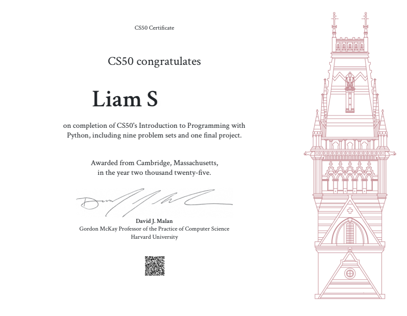
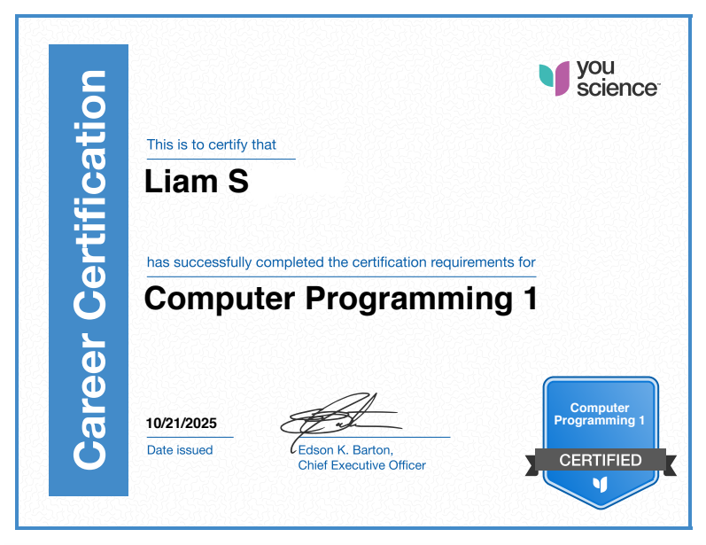
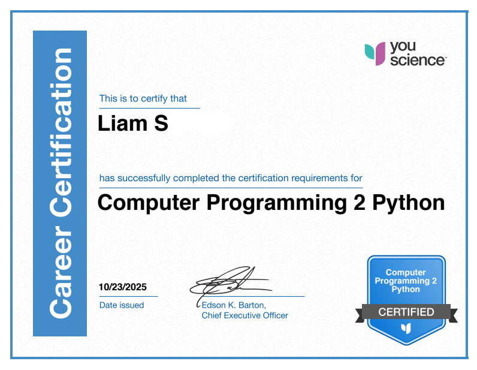
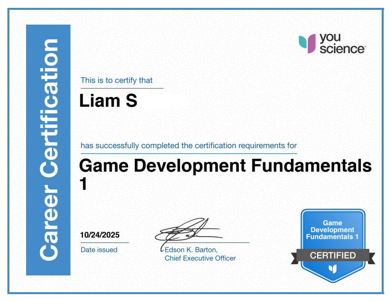

## My name is Liam

I am a software developer who specializes in backends and tinkering with systems.

### My Toolbelt
* C++
* CMake
* Lua
* Nim
* Odin
* Docker
* Python
* NodeJS
* Cloudflare
* Kotlin with Ktor
* JavaScript / TypeScript

### Currently, I'm learning / working on:
- Full-stack development, with a focus on backends
- Gaining knowledge in a multitude of languages
- Building a diverse GitHub profile to demonstrate my knowledge in the field

### Projects I've made:
1. [PyTerminal-Engine](https://github.com/lammmab/pyterminal-engine): CS50P final project terminal "game engine" written in Python.
2. Zero'd Card Game: A full, playable card game written in Odin and JavaScript.
3. [steam-min-cpp](https://github.com/lammmab/steam-min-cpp): Steam CM client connections manager built in C++.
4. [julianne](https://github.com/lammmab/julianne): A W.I.P. interpreted language built in Nim.

### I have earned 4 certificates as of October 29th, 2025:
1. CS50 with Python from Harvard University

4. Computer Programming 1 from YouScience

6. Computer Programming 2 Python from YouScience
   

8. Game Development Fundamentals 1 from YouScience

