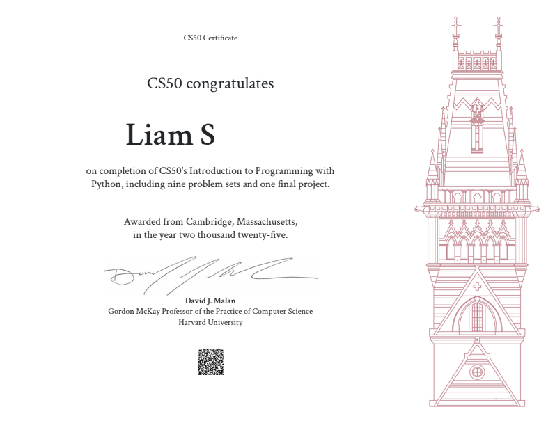

## My name is Liam.

I am a free-time developer, who specializes in backends, tinkering with systems, and making fun projects.

### Currently, I'm learning / working on:
- Full-stack development, with a focus on backends
- Gaining knowledge in a multitude of languages
- Building a portfolio to demonstrate my abilities.

## Building my first portfolio project:
- https://github.com/lammmab/decent-movies-portfolio
TypeScript, SvelteKit, and NodeJS

## I have these ideas in mind for my next portfolio projects:
1. E2E encrypted chat service
2. New, easy to edit portfolio page / blog site hosted on my main GitHub pages

### I have earned 4 certificates as of October 29th, 2025:
1. CS50 with Python from Harvard University

4. Computer Programming 1 from YouScience

6. Computer Programming 2 Python from YouScience
   

8. Game Development Fundamentals 1 from YouScience

### Projects I've made:
1. PyTerminal-Engine for the cs50 with Python final project. - first "game engine" project
2. Zero'd Card Game for the cs50 with Python final project, aswell as an Odin backend + PixiJS frontend version. - first project with a full-stack backend / frontend, sessions with websockets, and game state communication across multiple clients
3. Other small projects made in my free-time.
